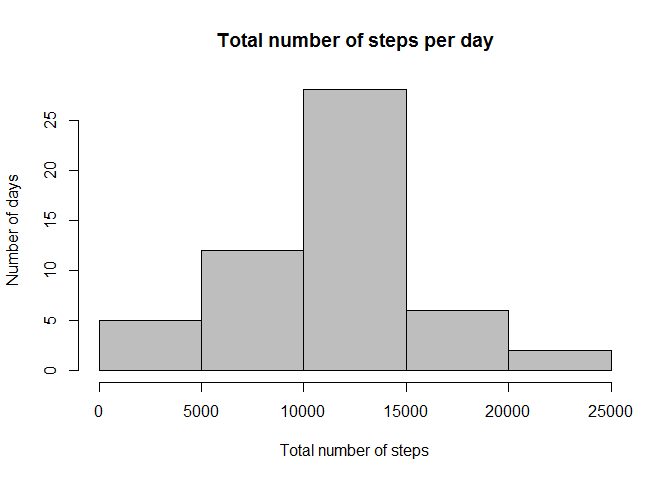

# Reproducible Research: Peer Assessment 1


## Loading and preprocessing the data

```r
activity <- read.csv("~/DataScience/Reproducible/activity.csv")
## Converting date column from factor to date
activity$date <- as.Date(activity$date)
```

## Calculating total number of steps and making a histogram.
X-axis is total number of steps per day in chunks of 5000 and y-axis is the number of measurements i.e. days that fall in each chunk


```r
## Summing up the number of steps per day
SumStepsDay <- activity %>% 
    group_by(date) %>% 
    summarize(TotalSteps=sum(steps))

## And outputing the histogram
hist(SumStepsDay$TotalSteps, 
     xlab="Total number of steps", 
     ylab="Number of days", 
     main="Total number of steps per day",
     col=8)
```

 


## What is mean and median of total number of steps taken per day?
Removing NAs since the result would otherwise be NA

```r
mean(SumStepsDay$TotalSteps, na.rm = TRUE)
```

```
## [1] 10766.19
```

```r
median(SumStepsDay$TotalSteps, na.rm = TRUE)
```

```
## [1] 10765
```


## What is the average daily activity pattern?
1.  Make a time series plot (i.e. type = “l”) of the 5-minute interval (x-axis) and the average number of steps taken, averaged across all days (y-axis)
2. Which 5-minute interval, on average across all the days in the dataset, contains the maximum number of steps?


## Imputing missing values


## Are there differences in activity patterns between weekdays and weekends?

