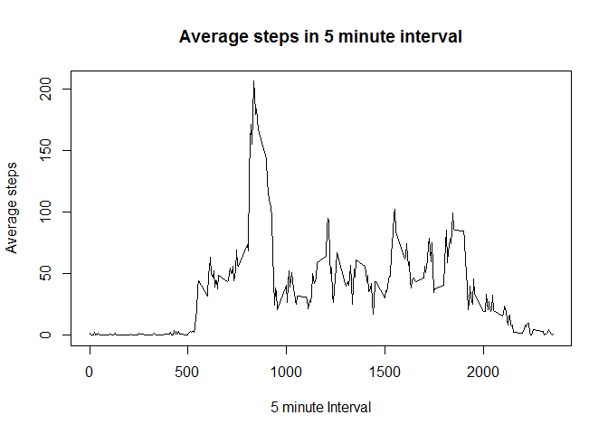
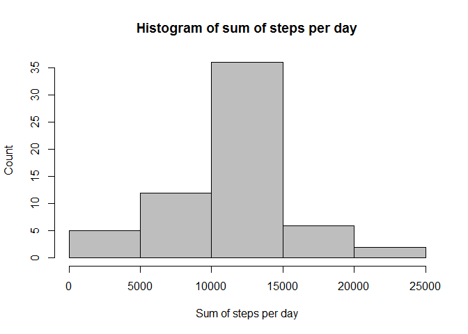
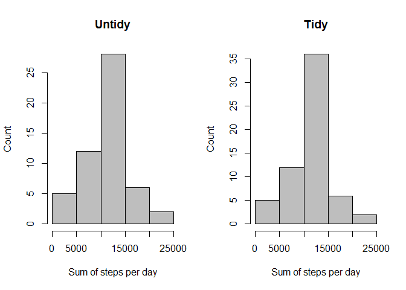
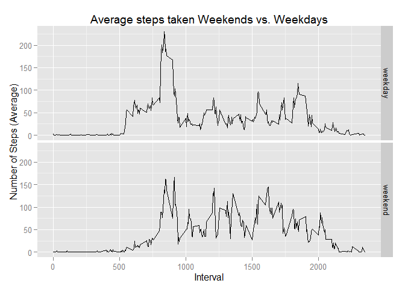

# Reproducible Research: Peer Assessment 1


## Loading and preprocessing the data
Code for loading the data. Converting date column into date format. I would normally remove NA's but since imputing is part of this exercise I keep them. 

```r
activity <- read.csv("~/DataScience/Reproducible/activity.csv")
## Converting date column from factor to date
activity$date <- as.Date(activity$date)
```

## Calculating total number of steps and making a histogram.
X-axis is total number of steps per day in chunks of 5000 and y-axis is the number of measurements i.e. days that fall in each chunk

```r
## Summing up the number of steps per day
SumStepsDay <- activity %>% 
    group_by(date) %>% 
    summarize(TotalSteps=sum(steps))

## And outputing the histogram
hist(SumStepsDay$TotalSteps, 
     xlab="Total number of steps", 
     ylab="Number of days", 
     main="Total number of steps per day",
     col=8)
```

 


## What is mean and median of total number of steps taken per day?
Mean number of steps: 

```r
## Removing NAs since the result would otherwise be NA
mean(SumStepsDay$TotalSteps, na.rm = TRUE)
```

```
## [1] 10766.19
```
Median number of steps: 

```r
## Removing NAs since the result would otherwise be NA
median(SumStepsDay$TotalSteps, na.rm = TRUE)
```

```
## [1] 10765
```


## What is the average daily activity pattern?
1.  Make a time series plot (i.e. type = “l”) of the 5-minute interval (x-axis) and the average number of steps taken, averaged across all days (y-axis)
2. Which 5-minute interval, on average across all the days in the dataset, contains the maximum number of steps?

```r
## Group data and summarize the average number of steps in that interval
SumInterval <- activity %>%
    group_by(interval) %>%
    summarize(AverageSteps=mean(steps, na.rm=TRUE))

## Make an average activity plot
plot(SumInterval$interval, SumInterval$AverageSteps, type="l",
     xlab="5 minute Interval",
     ylab="Average steps",
     main="Average steps in 5 minute interval")
```

 

The maximum number of steps in a 5 minute interval occurs at:

```r
## Maximum number of steps in an interval
SumInterval$interval[which.max(SumInterval$AverageSteps)]
```

```
## [1] 835
```

## Imputing missing values
1. Calculate and report the total number of missing values in the dataset (i.e. the total number of rows with NAs)
2. Devise a strategy for filling in all of the missing values in the dataset. The strategy does not need to be sophisticated. For example, you could use the mean/median for that day, or the mean for that 5-minute interval, etc.
3. Create a new dataset that is equal to the original dataset but with the missing data filled in.
4. Make a histogram of the total number of steps taken each day and Calculate and report the mean and median total number of steps taken per day. Do these values differ from the estimates from the first part of the assignment? What is the impact of imputing missing data on the estimates of the total daily number of steps?
The total number of missing values is:

```r
# Calculate number of missing values
sum(is.na(activity$steps))
```

```
## [1] 2304
```
I am using the mean for the time interval to fill in the NAs

```r
## Filling in NAs with average number of steps in a 5 minute interval if an NA is
## found in the interval
Tidydata <- activity
for (i in 1:nrow(Tidydata)) {
    if (is.na(Tidydata$steps[i])) {
        # Average can be found in SumInterval at the same index value
        index <- which(Tidydata$interval[i] == SumInterval$interval)
        # Assign the value to replace the NA
        Tidydata$steps[i] <- SumInterval[index,]$AverageSteps
    }
}
```
And then plot the dataset with a histogram

```r
# Group by date and summarize steps
Sumstepsperday <- Tidydata %>% 
    group_by(date) %>% 
    summarize(TotalSteps=sum(steps))

# Show histogram of steps per day
hist(Sumstepsperday$TotalSteps, 
     xlab="Sum of steps per day", 
     ylab="Count", 
     main="Histogram of sum of steps per day",
     col=8)
```

 

The mean number of steps per day after replacing NAs with averages for interval is:

```r
mean(Sumstepsperday$TotalSteps)
```

```
## [1] 10766.19
```
Which is and should be the same before filling in
The median number of steps per day after replacing NAs with averages for interval is:

```r
median(Sumstepsperday$TotalSteps)
```

```
## [1] 10766.19
```
Which has moved slightly up and is equal to the mean. This means that the impact of imputing NAs with average for the 5 minute interval is very little.
The impact on the total number of steps can be seen by combining the histograms of the non-filled in data and the filled in data

```r
## Calculating sum of steps per day in the untidy data
UnTidySumstepsperday <- activity %>% 
    group_by(date) %>% 
    summarize(TotalSteps=sum(steps))
par(mfrow=c(1,2))
## Plotting the histograms
hist(UnTidySumstepsperday$TotalSteps,
     xlab="Sum of steps per day",
     ylab="Count", main="Untidy",
     col=8)
hist(Sumstepsperday$TotalSteps, 
     xlab="Sum of steps per day", 
     ylab="Count", 
     main="Tidy",
     col=8)
```

 

As can be seen from the graphs the count has gone up but the maximum AVERAGE number of steps remains the same:

```r
## Maximum of the tidy data
max(Sumstepsperday$TotalSteps)
```

```
## [1] 21194
```

```r
## maximum of the untidy data
max(UnTidySumstepsperday$TotalSteps, na.rm = TRUE)
```

```
## [1] 21194
```

Whereas the total number of steps, unsurprisingly, has gone up:

```r
## sum without filled in NAs
sum(activity$steps, na.rm = TRUE)
```

```
## [1] 570608
```

```r
## Sum with filled in NAs
sum(Tidydata$steps)
```

```
## [1] 656737.5
```

## Are there differences in activity patterns between weekdays and weekends?
For this part the weekdays() function may be of some help here. Use the dataset with the filled-in missing values for this part.

1 Create a new factor variable in the dataset with two levels – “weekday” and “weekend” indicating whether a given date is a weekday or weekend day.

2 Make a panel plot containing a time series plot (i.e. type = "l") of the 5-minute interval (x-axis) and the average number of steps taken, averaged across all weekday days or weekend days (y-axis). See the README file in the GitHub repository to see an example of what this plot should look like using simulated data.

```r
## Using the weekdays function to make weekday variable in the Tidydata dataframe
Tidydata$day <- weekdays(Tidydata$date)
## Define all days as weekdays
Tidydata$daytype <- "weekday"
## Re-define days that are saturday or sunday to be weekends. NOTE that this
## code will only work with a compatible sys.setlocale, e.g. US.
Tidydata$daytype[Tidydata$day %in% c("Saturday", "Sunday")] <- "weekend"

## Group and summarize on averages per day
dayaverage <- Tidydata %>%
    group_by(daytype, interval) %>%
    summarize(AverageSteps=mean(steps))
## And plot steps on weekdays versus steps on weekends using ggplot2
par(mfrow=c(1,2))
qplot(interval, AverageSteps, data=dayaverage,
      type="l",
      geom="line",
      xlab="Interval",
      ylab="Number of Steps (Average)",
      main="Average steps taken Weekends vs. Weekdays",
      facets=daytype ~ .)
```

 

There is more activity on weekdays and activity starts earlier on weekdays than on weekends. It would be interesting to see if there is a difference between people with and without children and singles versus couples. But alas, we are running out of assignment.
